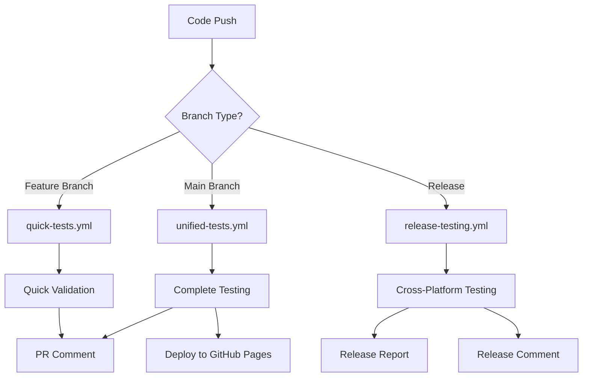

# M1K3 CI/CD Pipeline

Comprehensive continuous integration and deployment pipeline for the M1K3 AI assistant project using the M1K3 Unified Test Suite.

## 🚀 Workflows Overview

### 1. `unified-tests.yml` - Complete Test Suite
**Triggers**: Push to main/develop, Pull Requests, Daily schedule
**Duration**: ~15-20 minutes
**Features**:
- ✅ **Cross-Platform Testing**: Ubuntu with Node.js 18/20 + Python 3.9/3.11 matrix
- ✅ **Complete Test Coverage**: Unit, Integration, Visual, Performance, Security, E2E, API
- ✅ **Screenshot Testing**: Visual regression with Playwright across viewports
- ✅ **Security Auditing**: Dependency vulnerabilities, code analysis, secrets scanning
- ✅ **Beautiful Reports**: M1K3-branded HTML reports with interactive features
- ✅ **GitHub Pages**: Automatic deployment of test reports to GitHub Pages
- ✅ **Artifacts**: 30-day retention of reports, screenshots, and data exports
- ✅ **PR Comments**: Automated test result summaries on pull requests

### 2. `quick-tests.yml` - Fast Validation  
**Triggers**: Feature branch pushes, PR opens/updates
**Duration**: ~5-10 minutes
**Features**:
- ⚡ **Fast Feedback**: Quick validation for development branches
- 🔍 **Test Discovery**: Rapid scanning of test coverage
- 🔒 **Security Quick Scan**: High-level vulnerability checks
- 📋 **PR Status**: Quick validation status comments
- 🎨 **Code Quality**: ESLint, Prettier, Flake8, Black checks

### 3. `release-testing.yml` - Comprehensive Release Validation
**Triggers**: Release publish, Manual dispatch
**Duration**: ~30-45 minutes  
**Features**:
- 🌍 **Cross-Platform**: Linux, macOS, Windows testing
- 📦 **Multi-Version**: Node.js 18/20/22 + Python 3.9/3.11/3.12 matrix
- 🧪 **Complete Coverage**: All test categories including TDD workflow
- 📊 **Release Report**: Consolidated testing summary for release notes
- 📤 **Long-term Storage**: 365-day artifact retention for releases
- 💬 **Release Comments**: Automatic test summary on release pages

## 📊 Quality Gates

### Automatic Checks
- **Minimum Test Coverage**: 50+ individual tests required
- **Security Thresholds**: No high/critical vulnerabilities allowed
- **Build Success**: All workflows must complete successfully
- **Cross-Platform**: Tests must pass on all target platforms

### Manual Gates (Release)
- **Visual Regression**: Screenshot comparisons reviewed
- **Performance Baseline**: No significant performance degradation
- **Security Audit**: Complete vulnerability assessment
- **Documentation**: Test coverage and API documentation updated

## 🎯 Artifact Types

### Test Reports (`m1k3-test-reports-*`)
- **HTML Reports**: M1K3-branded interactive test reports
- **JSON Data**: Machine-readable test results and metrics
- **CSV Exports**: Spreadsheet-compatible test data
- **XML/YAML**: Alternative data formats for integration

### Screenshots (`m1k3-screenshots-*`)
- **Current**: Latest screenshot captures
- **Baseline**: Reference screenshots for comparison
- **Diff**: Visual difference highlights

### Release Reports (`m1k3-release-report-*`)
- **Consolidated Summary**: Cross-platform test results
- **Quality Metrics**: Coverage, performance, security analysis
- **Trending Data**: Historical comparison with previous releases

## 🔧 Configuration

### Environment Variables
```yaml
# Optional: Custom test configuration
TEST_TIMEOUT: 600000        # Maximum test duration (ms)
SCREENSHOT_THRESHOLD: 0.2    # Visual difference threshold
SECURITY_LEVEL: high         # Security audit sensitivity
REPORT_RETENTION: 30         # Artifact retention days
```

### Secrets Required
```yaml
# Automatically provided by GitHub
GITHUB_TOKEN: ${{ secrets.GITHUB_TOKEN }}

# Optional: External integrations
SLACK_WEBHOOK: ${{ secrets.SLACK_WEBHOOK }}      # Slack notifications
TEAMS_WEBHOOK: ${{ secrets.TEAMS_WEBHOOK }}      # Teams notifications
```

## 🎨 Report Features

### Interactive HTML Reports
- **Pure Black Design**: M1K3 brand-aligned styling
- **User Journey Screenshots**: Organized by workflow
- **Interactive Filtering**: Category, framework, viewport filters
- **Modal Viewing**: Click-to-expand screenshot gallery
- **Responsive Design**: Mobile-friendly interface
- **Export Options**: JSON, CSV, XML, YAML data exports

### GitHub Pages Integration
- **Automatic Deployment**: Latest reports deployed to GitHub Pages
- **Historical Archive**: Previous reports accessible via navigation
- **Direct Links**: Shareable URLs for stakeholder review
- **Mobile Optimized**: Professional viewing on all devices

## 📈 Usage Examples

### Local Development
```bash
# Run quick validation before push
cd tests/unified-suite
npm run test:quick

# Generate local report
npm run discover && npm run report
```

### CI/CD Integration
```bash
# Trigger manual release testing
gh workflow run release-testing.yml -f version=v1.2.3

# View latest test results
gh run list --workflow=unified-tests.yml

# Download test artifacts
gh run download <run-id>
```

### Report Access
```bash
# GitHub Pages URL
https://<username>.github.io/<repo>/

# Direct artifact download
https://github.com/<username>/<repo>/actions/runs/<run-id>
```

## 🔄 Workflow Dependencies



## 🚨 Troubleshooting

### Common Issues
1. **Playwright Installation Fails**
   - Solution: Check system dependencies, use `--with-deps` flag

2. **Screenshot Comparisons Fail**
   - Solution: Update baseline screenshots, adjust threshold

3. **Security Audit Blocks**
   - Solution: Update dependencies, whitelist false positives

4. **Matrix Build Timeouts**
   - Solution: Optimize test suite, increase timeout values

### Debug Commands
```bash
# Local test reproduction
npm run test:visual -- --debug
npm run audit -- --verbose

# CI environment simulation
act -j unified-testing  # Using nektos/act
```

## 📚 Additional Resources

- [M1K3 Unified Test Suite Documentation](../tests/unified-suite/README.md)
- [GitHub Actions Documentation](https://docs.github.com/en/actions)
- [Playwright CI Guide](https://playwright.dev/docs/ci)
- [GitHub Pages Setup](https://pages.github.com/)

---

**Generated by M1K3 Unified Test Suite** 🤖