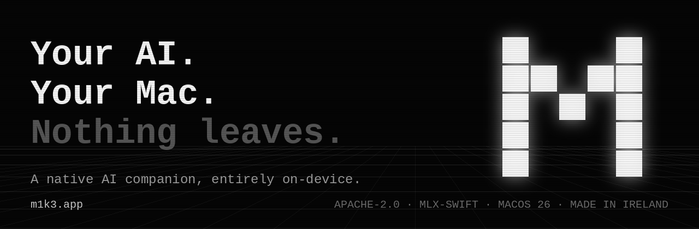

<p align="center">
  
</p>

<h1 align="center">M1K3 — Own your AI</h1>

<p align="center">
A native AI companion that runs <strong>entirely on your Apple-Silicon Mac</strong> —
local LLM inference, live voice, a personal knowledge graph with RAG, encrypted
call transcription, a local agent, and an MCP server.<br>
Edge AI you actually own: no cloud, no telemetry, no network cable it never asks for.
</p>

<p align="center">
  <a href="https://github.com/Round-Tower/m1k3/releases/latest/download/M1K3.dmg"><strong>⬇ Download for macOS</strong></a>
  · <a href="https://m1k3.app">m1k3.app</a>
  · <a href="https://testflight.apple.com/join/UCUJGbJe">TestFlight beta</a>
</p>

<p align="center"><em>Requires macOS 26 Tahoe · Apple Silicon · signed & notarized (Developer ID).</em></p>

<p align="center">
  <a href="https://github.com/Round-Tower/m1k3/actions/workflows/ci.yml"></a>
  <a href="https://github.com/Round-Tower/m1k3/actions/workflows/security.yml"></a>
  <a href="https://github.com/Round-Tower/m1k3/actions/workflows/claude-code-review-mac.yml"></a>
</p>

<p align="center">
  <a href="LICENSE"></a>
  <a href="https://github.com/Round-Tower/m1k3/releases/latest"></a>
  
  
  <a href="https://murphysig.dev/signed/Round-Tower/m1k3/"></a>
</p>

---

## What's inside

- **On-device inference** — MLX (Gemma, Qwen) + Apple Foundation Models. The model lives on your Mac.
- **Live voice** — speak and be spoken to; neural TTS + on-device speech-to-text.
- **Knowledge graph + RAG** — drop in notes and PDFs; M1K3 remembers and cites, locally.
- **Call memory** — encrypted, on-device call transcription.
- **A local agent** — tools that *do* things, grounded in your own data.
- **MCP server** — expose M1K3's local capabilities to Claude and other agents.

Everything above runs without leaving the device. The only network use is the
one-time model download and an optional, explicitly-enabled web search.

> **Repo map:** this is a multi-surface monorepo. The flagship is the native
> **macOS app** under [`macos/`](./macos). The repo root is the original **Python
> desktop CLI / MCP server** (documented below). The mobile app lives in
> [`app/`](./app). For the live state of anything, `CLAUDE.md` leads this file.

| Surface | Where | Stack | Status |
|---|---|---|---|
| **macOS native** | [`macos/`](./macos) | Swift 6.2, SwiftUI, MLX-Swift | **Flagship** — on-device knowledge · RAG · agent · voice · calls. See [`macos/PLAN.md`](./macos/PLAN.md). |
| **Desktop CLI / MCP** | repo root, `src/` | Python 3.12, MLX-LM | Runs. The original surface (documented below). |
| **間 AI mobile** | [`app/`](./app) | Kotlin Multiplatform | Slow burn — Android first, iOS next. See [`app/README.md`](./app/README.md). |

---

# Desktop CLI / MCP server

The rest of this README covers the Python surface at the repo root.

## Quick start

```bash
git clone https://github.com/Round-Tower/m1k3.git
cd m1k3
pip install -r requirements.txt

# Download local models (AI + embeddings + voice)
python src/models/loaders/download_models.py

# Run (legacy Python CLI — see _legacy/)
python _legacy/m1k3.py --no-voice    # CLI, no audio
python _legacy/m1k3.py --tui --rag   # TUI with retrieval
python _legacy/cli.py                # CLI with the avatar dashboard
```

**Apple Silicon (recommended):** M1K3 auto-detects an MLX-LM server on port 8080
and prefers it. Start one with:

```bash
mlx-env/bin/mlx_lm.server --model mlx-community/SmolLM2-135M-Instruct --port 8080
```

See [`docs/MLX_SETUP.md`](./docs/MLX_SETUP.md) for the full setup.

## AI backends

Backends are tried in priority order with automatic fall-through, so M1K3 always
runs — even with nothing installed (the mock fallback answers).

1. **MLX-LM** — Apple Silicon (Metal), fastest on M-series; via `mlx_lm.server` on `:8080`
2. **Ollama** — universal local API
3. **HuggingFace Transformers** — TinyLlama / SmolLM2
4. **ctransformers** — GGUF quantized models
5. **SimpleAIEngine** — dependency-free mock fallback

## Features

- **RAG** — hybrid retrieval over a local knowledge base. Engine:
  [`src/rag/m1k3_rag_engine.py`](./src/rag/m1k3_rag_engine.py). Embeddings:
  `BAAI/bge-small-en-v1.5`.
- **Voice (TTS)** — content-aware synthesis (Kokoro / Piper) that adapts to
  thinking vs. answer vs. narration. Engines in `src/engines/tts/`.
- **Voice input (STT)** — multi-engine with fallbacks: macOS native (0 MB),
  Vosk (offline), Web Speech, Whisper. Engines in `src/engines/stt/`.
- **3D avatar** — THREE.js companion with 13 animated models and emotion state.
  Web demo: `cd src/web-avatar && npm run dev` → <http://localhost:5174/demo-legacy.html>.
  Standalone Tauri popover: `cd src/avatar-popover && cargo tauri dev` (⌘⇧M) (legacy demo — dormant since 2026-02, superseded by the native Mac companion).
- **MCP server** — exposes M1K3 to Claude Desktop (below).

## MCP integration

The live MCP surface is the **Mac app's in-app HTTP server** — see
[`macos/CLAUDE.md`](./macos/CLAUDE.md#mcp-exposure-two-surfaces) and
[`docs/MCP_SETUP.md`](./macos/docs/MCP_SETUP.md). `.mcp.json` at the repo root
points Claude Code at `http://127.0.0.1:4242/mcp` while the app is running.

[`mcp_unified_server.py`](./_legacy/mcp_unified_server.py) is the legacy Python MCP
server (pre-Mac-app) — it's no longer referenced by `.mcp.json` and isn't the
active path.

## Layout

```
m1k3/
├── _legacy/                  # Legacy Python CLI (m1k3.py, cli.py, …) — archived
├── src/
│   ├── engines/ai/            # AI backends (MLX, SmolLM2, …)
│   ├── engines/tts/           # Text-to-speech (Kokoro, Piper)
│   ├── engines/stt/           # Speech-to-text engines
│   ├── rag/                   # RAG engine
│   ├── database/              # Vector memory, conversation storage
│   ├── web-avatar/            # THREE.js 3D avatar
│   └── avatar-popover/        # Tauri standalone app
├── macos/                     # macOS native MVP (Swift) — see macos/PLAN.md
├── app/                       # 間 AI mobile (KMP) — see app/README.md
├── tests/                     # pytest suite (see tests/CI_TRIAGE.md)
└── docs/                      # MLX, STT, voice, plans
```

## Development

```bash
pip install -r requirements.txt
python -m pytest tests/                 # full suite (needs heavy deps)
pip install -r requirements-ci.txt      # slim CI deps
```

The full Python suite needs the heavy ML stack and is partly legacy; CI runs a
curated green subset. See [`tests/CI_TRIAGE.md`](./tests/CI_TRIAGE.md) for what's
in CI and the rehabilitation backlog, and
[`.github/workflows/README.md`](./.github/workflows/README.md) for the pipeline.

Architecture and current state: [`CLAUDE.md`](./CLAUDE.md).

## Privacy

Inference, retrieval, and voice run on-device. No telemetry; conversations stay
on your machine. Network is only used to download models on first run.

## License

**[Apache License 2.0](./LICENSE).** M1K3 is free and open source — use it, fork
it, build on it, commercially or otherwise. Attribution and third-party notices
are in [`NOTICE`](./NOTICE).

Contributions are welcome — start with [`CONTRIBUTING.md`](./CONTRIBUTING.md)
(build-from-source lives in [`macos/README.md`](./macos/README.md), security
reports go through [`SECURITY.md`](./SECURITY.md)). Contributions are accepted
under the same Apache-2.0 terms (per
section 5 of the License). M1K3 is built in the open with
[MurphySig](https://murphysig.dev) provenance — the git history is signed,
human-and-AI collaboration on the record.
